# 一、简单数据类型

## 一、变量与常量

### Python 的数据类型

Python 定义了 6 组标准数据类型：
- Number 数字
- String 字符串
- List 列表
- Tuple 元组
- Sets 集合
- Dictionay 字典

### 变量

python 定义变量的语法为：variableName = value，如：
`a = 3 `
`s = “hello world”`
- 注意：同一变量可以反复赋值，而且可以是不同类型的变量

```python
x=8
print(x,type(x))	#type()函数用于查看对象的数据类型
x="eight"
print(x,type(x))
```

### 常量

常量表示“不能变”的量
Python 中是没有常量的关键字的，只是我们常常约定使用大写字母组合的变量名表示常量，也有不要对其进行赋值的提醒作用。

```python
PI = 3.14
```

## 二、数值类型

### 整数 int

- 与数学中整数的概念一致，整数可正可负
- 整数的大小受限于机器内存的大小

### 浮点类型 float

对于很大或很小的浮点数，必须用科学计数法表示，具体表示方式：把 10 用 e 替代。
如：1.23 x 109 可以写成 1.23 e 9，或者 12.3 e 8，0.000012 可以写成 1.2 e-5

```python
a=1.2e9
a
b=1.2e-5
b
```

### 布尔型值

布尔值类型是一种特殊的数据类型，表示真（True）/假（False） 值，它们分别映射到整数 1 和 0。

### 复数

与数学中复数的概念一致 a+bj 被称为复数，其中：a 是实部，b 是虚部

z = 1 + 2 j
- z.real 获得实部
- z.imag 获得虚部

- math 模块提供了许多对浮点数的数学运算函数;
- cmath 模块包含了一些用于复数运算的函数。

### 数值运算操作符


### 增强赋值操作符


### 数值类型间的混合运算

- 类型间可进行混合运算，生成结果为 " 最宽 " 类型
- 三种类型存在一种逐渐 " 扩展 " 或 " 变宽 " 的关系：**整数 -> 浮点数 -> 复数**
- 例如：123 + 4.0 = 127.0 (整数 + 浮点数 -> 浮点数)

## 三、字符串

### 字符串的定义

由 0 个或多个字符组成的有序序列称为“字符串”。

### 字符串的表示

由一对**单引号**或**双引号**表示，仅表示单行字符串。例如：‘abcabc’、‘123’、“你好”都是字符串。

由一对**三单引号**或**三双引号**表示，可表示多行字符串。

```python
s = """hello 
world"""
```

如果希望在字符串中包含双引号或单引号呢？
`i'm a student`
`abc"de"`
- 字符串中是单引号，外部就用双引号；
- 字符串中是单引 号，外部就用双 引号；反之亦然

```python
print("i'm a student")
print('abc"de"')
```

如果希望在字符串中既包括单引号又包括双引号呢？

如：` ‘我’爱"Python"`
又如：` '我'爱'python' `

```python
print(''''我'爱Python"''')
print("\'我\'愛\"Python\"")
```

如果不想\作为转义字符，而是想输出\，那应该怎么做呢？
例如，我们要输出的字符串为 \'
- 当字符串中所有字符都需要按其字面意义理解时，可以在字符串前面加 r 引导

```python
print(r"\'")
```

### 转义符


### 字符串分片与步距

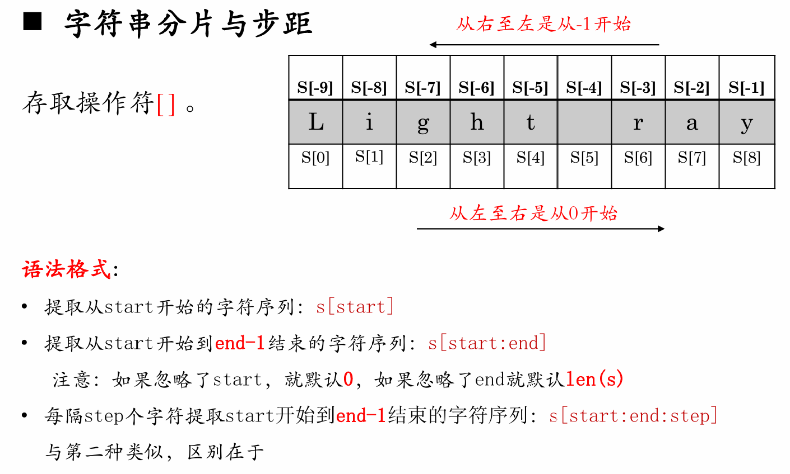

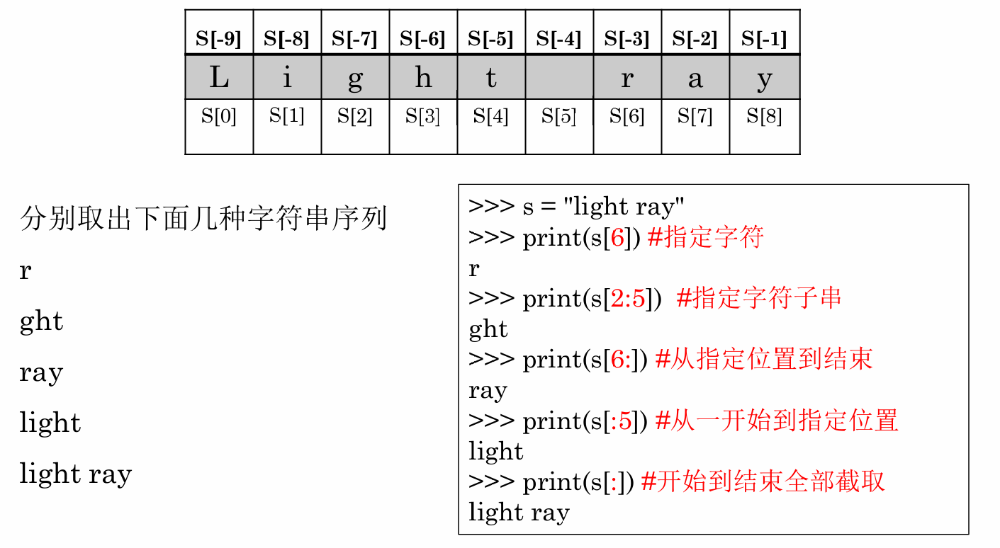

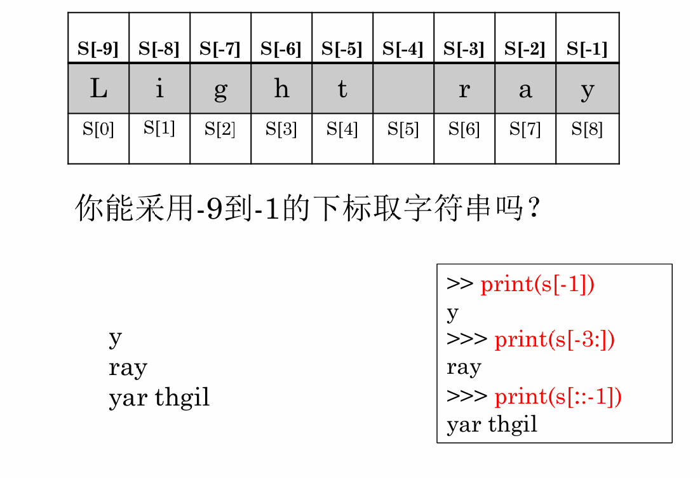

### 字符串常见操作符


### 字符串常用内置函数

- `str ()`：str() 函数可以将数字对象、列表对象、元组等转换成字符串
- `len ()`：len() 函数返回字符串的长度
- `str.upper()`：将字符串中的小写字母转换为大写字母
- `str.lower()`：将字符串中的大写字母转换为小写字母
- `str.swapcase()`：将字符串中大写转换为 小写，小写转换为大写

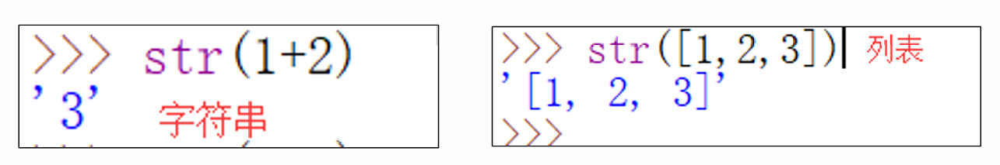

- `str.strip()`：用于删除字符串头尾指定的字符（默认为空格）
- `str.lstrip()`：用于截掉字符串左边的空格或指定字符
- `str.rstrip()`：用于删除字符串字符串末尾的空格

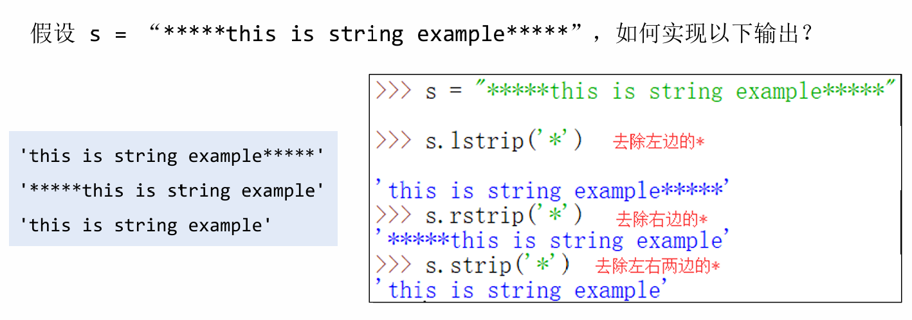

- `str.split()`：通过指定分隔符对**字符串进行切片**
- `str.split(参数1, 参数2)`：参数 1：分隔符，参数 2：分割次数。返回值为分割后的**字符串列表**


### 字符串常用方法

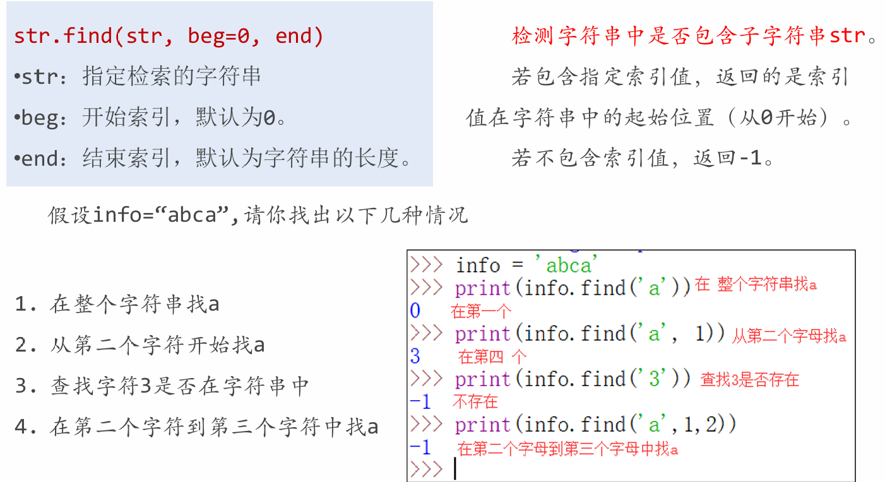


- `str.join (sequence)`：用于将序列中的元素以指定的字符连接生成一个新的字符串。
- `- sequence --` ：要连接的元素序列。


### 字符串格式化

- Python 中格式化字符串的方式和 C 一致，用% 实现
- 浮点数特别说明


- fortmat() 方法会返回一个新字符串，在新字符串中，原字符串的替换字段被适当格式化后的参数所替代。

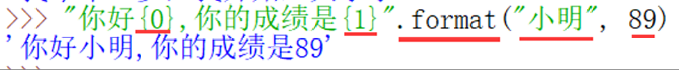

- 在 format() 中还可以使用“关键字参数”的方式，如：

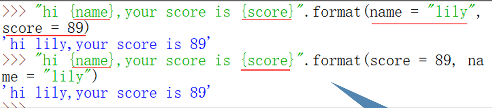

- 在 format() 中“位置参数”可以与“关键字参数”混用，但要注意：关键字参数必须总在位置参数之后，否则报错。

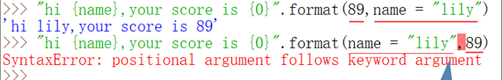

### 数据类型占用内存空间

使用 `sys.getsizeof` 查看 python 对象的内存占用，单位：字节 (byte)

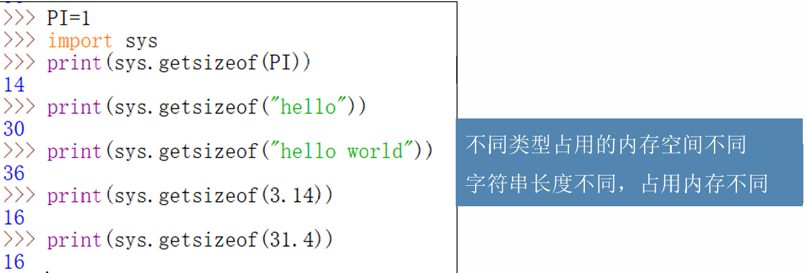

## 四、输入输出

### 输出语句

- 字符串、数值、列表、元组和字典等类型都可以用 print() 函数直接输出。
- `print()` 函数也可以接受多个字符串，用逗号“,”隔开，就可以连成一串输出：

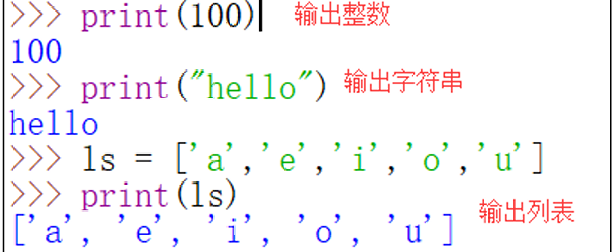


- `print()` 函数之 end


### 输入语句

`input()` 函数：输入文本类型

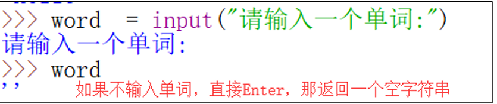

`input()` 函数：输入数值类型
- `input(` ) 函数只能输入文本。
- 对于数值型的数据，需要使用 ` eval()` 函数将文本转换为数值。


# 二 、序列类型

## 一 、列表

### 序列类型

序列是具有先后关系的一组元素；
Python 的序列类型包括**列表**、**元组**、**集合**和**字典**。

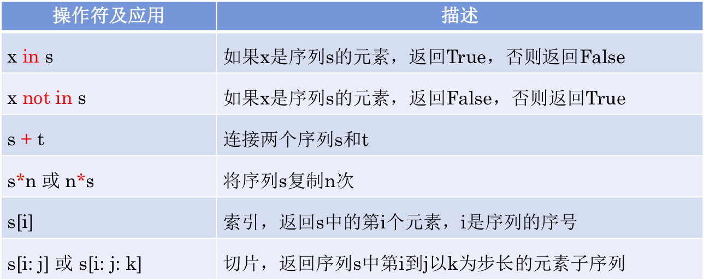

### 序列类型

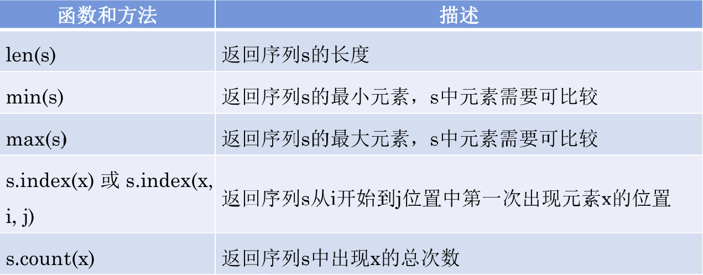

### 列表类型

列表的定义：列表名=[元素 0,元素 1,…,元素 n]

列表的创建： 使用 [] 或 list() 函数创建 ，元素间用逗号分隔

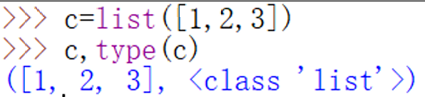

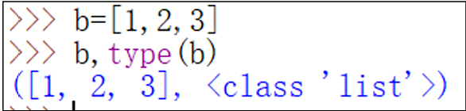

### 列表创建


## 二 、元组


## 三、集合


## 四、字典
